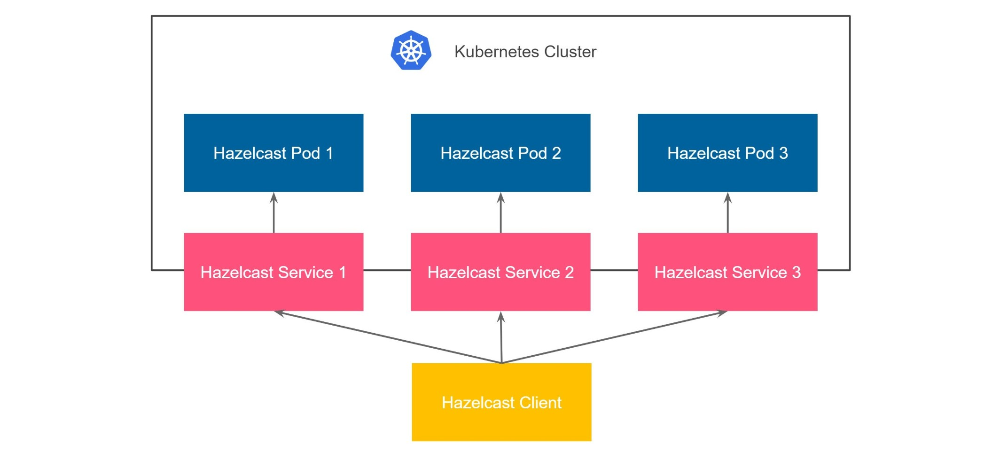

There are two available options for Expose Externally feature of Hazelcast Platform Operator:
* Unisocket - client requests are load balanced between Hazelcast members.
* Smart - client connects to all members and sends requests directly to the members owning the data.
In this tutorial we will use Smart Client. 



> **Note:**
>
> Hazelcast Enterprise requires a **license key**. If you don’t have a license key, you can request one from the [Hazelcast website](http://trialrequest.hazelcast.com/)
<br>
>
To start the Hazelcast Cluster we need: 
1. Paste your license key into the dialog window and click **Enter**.
2. Create a Kubernetes secret to hold your license key.
    ```
    kubectl create secret generic hazelcast-license-key --from-literal=license-key="$LICENSE_KEY"
    ```{{exec}}
   
2. Start the Hazelcast Cluster by applying Hazelcast custom resource file `hazelcast.yaml`.
    ```
    kubectl apply -f /root/hazelcast.yaml --wait
    kubectl wait --for=jsonpath='{.status.phase}'=Running --timeout=120s hazelcast/hazelcast || kubectl get hazelcasts.hazelcast.com hazelcast -o wide
    ```{{exec}}

Finally, verify that Hazelcast cluster is up and running by clicking **CHECK** button.
